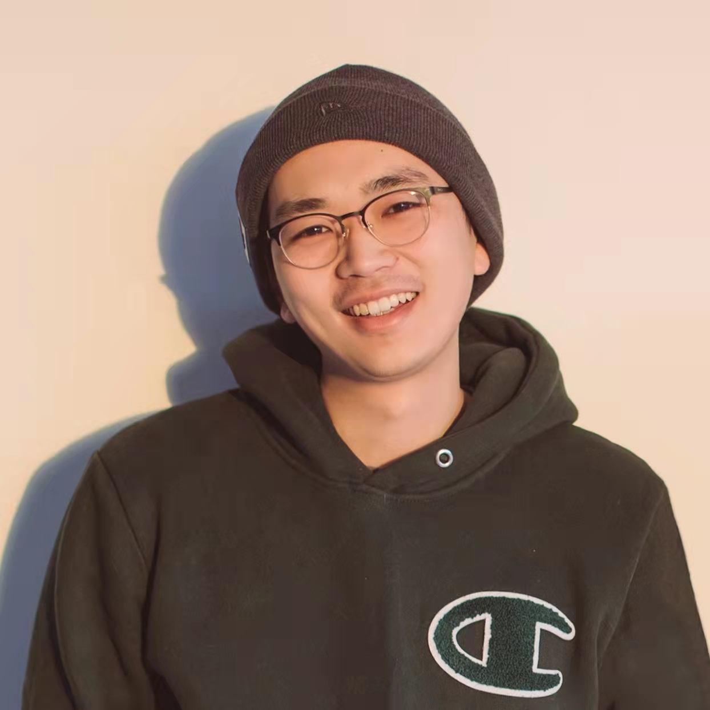

# About Me

<!--  -->

Here is **Li Shuhao (李书豪)**.

I am a Ph.D candidate in the School of Journalism & Communication at Nanjing University, advised by [Prof. Zhou Kai](https://jc.nju.edu.cn/info/1641/2271.htm). I graduated from the Department of Film & TV Art at Central Academy of Drama, majoring in Drama and Film Studies.

During my master's degree, I did an internship at Monkey Dirty Film Studios. After graduation, I took a teaching position at Communication University of China, Nanjing (aka [CUCN](https://www.cucn.edu.cn/#/Home)).

---

## Research Interests

- Film Industry
- Sports Communication

---

## News and Updates

- **September 2024**：Very excited to be selected as [KDD UC Scholar](https://kdd2024.kdd.org/undergraduate-consortium/). See you in Spain!
- **May 2024：**My bachelor thesis won the Annual Best Thesis Award (Top 1/300).
- **April 2024：**Our work *BLEGuard* has been accepted to [MobiSys 2024](https://www.sigmobile.org/mobisys/2024/) as a poster paper. See you in Japan!
- **March 2024：**Very excited to get a MPhil offer from Engineering department at Cambridge University!
- **Dec 2023：**Very excited to be selected as [AAAI UC Scholar](https://aaai.org/aaai-conference/undergraduate-consortium-program/). See you in Canada!
- **Jun 2022：**Started research programme at [Cambridge AI Group](https://www.cl.cam.ac.uk/research/ai/), advised by Prof. Pietro Liò.

 

<blockquote class="twitter-tweet">
Thrilled to be an AAAI-UC Scholar at <a href="https://twitter.com/hashtag/AAAI24?src=hash&amp;ref_src=twsrc%5Etfw">#AAAI24</a>, thanks to <a href="https://twitter.com/hashtag/AAAI?src=hash&amp;ref_src=twsrc%5Etfw">#AAAI</a> &amp; <a href="https://twitter.com/hashtag/GoogleExploreCSR?src=hash&amp;ref_src=twsrc%5Etfw">#GoogleExploreCSR</a> for the sponsorship. Grateful for the knowledge gained and new friendships formed.  Wonderful trip in Vancouver. Looking forward to staying connected with all.<a href="https://twitter.com/hashtag/AAAI24?src=hash&amp;ref_src=twsrc%5Etfw">#AAAI24</a> <a href="https://twitter.com/hashtag/Vancouver?src=hash&amp;ref_src=twsrc%5Etfw">#Vancouver</a> <a href="https://twitter.com/hashtag/GoogleExploreCSR?src=hash&amp;ref_src=twsrc%5Etfw">#GoogleExploreCSR</a> <a href="https://t.co/wUQUp8XlSM">pic.twitter.com/wUQUp8XlSM</a>
&mdash; Hanlin CAI (seeking a PhD position 2025) (@lancecai2002) <a href="https://twitter.com/lancecai2002/status/1762210025173344260?ref_src=twsrc%5Etfw">February 26, 2024</a></blockquote> 

