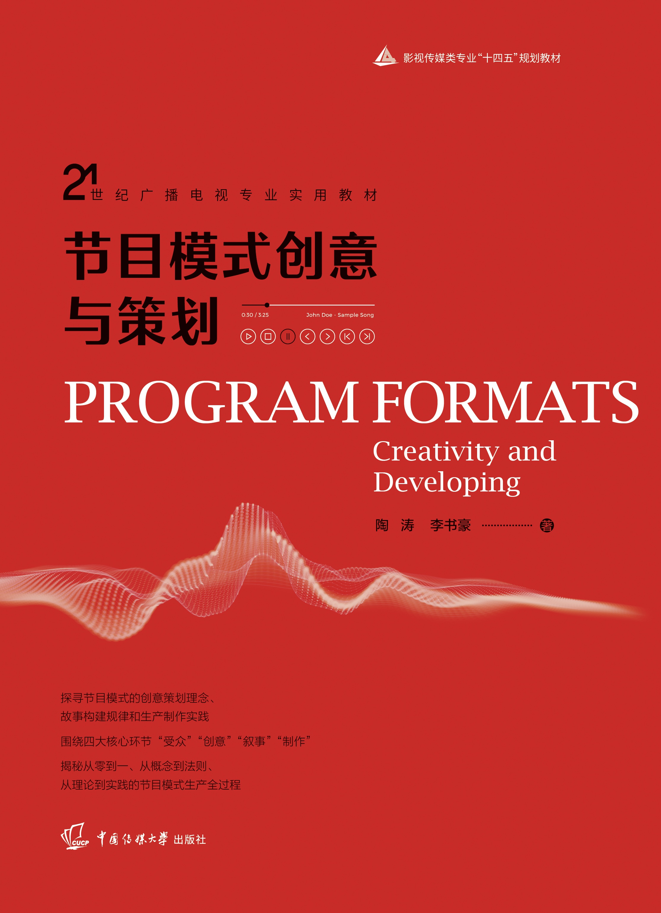

<!-- #> (†: equal contribution, ~: corresponding author) -->

## Research Publications  

- 重组与错位：综艺节目模式研发的创意方法探析，《中国新闻传播研究：融合传播与社会治理》，2/3，2022.10

- 现象级节目跨文化传播特征探析，《新闻研究导论》，2/2，2022.2

- 视听节目模式中塑造人物的三种类型叙事，《中国新闻传播研究》，2/3，2021.11

- 浅析基于人性需求的影视节目模式创意思维，《艺术教育》，2/2，2017.11

   

---

## Textbook Publications

  

- [PROGRAM FORMATS: Creativity and Developing.](https://book.douban.com/subject/35803694/) Published by Communication University of China Publisher, 2022-3.

   

Based on the two dimensions of innovative thinking, research and development strategy, and storytelling strategy of the program, ***PROGRAM FORMATS: Creativity and Developing*** deeply restores the full set of industrial process of program format creativity and content production, and comprehensively introduces the definition of program format, audience survey of program format, creative thinking method of program format, law of narrative of program format, and how to write the text of the program format and formulate the handbook of the program format, etc., and reveals the secret of the whole process of program format production from the perspective of the first-line creators. From the perspective of the industry's first-line creators, the book reveals the creative production process of film and television program formats from scratch, from coarse to fine, and from virtual to real. ***PROGRAM FORMATS: Creativity and Developing*** selects a number of phenomenal program formats, in-depth analysis of program format creation methods and principles, and carefully configure dozens of work templates, so that readers can quickly master the creation of program format methods, into the state of practice; can be used as a professional textbook for film, television, and media, but also as a media practitioners and enthusiasts of the study book.

 

---

## Degree Thesis

- The Research on Creative Thinking and Method of Phenomenal Format.  **Li Shuhao** (Advisor: Tao Tao). Master's Thesis. 

   

---

## <!--Early Project-->

<!--[Proposal: Securing Billion Bluetooth Devices leveraging Learning-based Techniques](https://ojs.aaai.org/index.php/AAAI/article/view/30544) *Final year project (FYP).* **Hanlin Cai** (Advisors: Zhezhuang Xu, Tozammel Hossain) The 38th Annual AAAI Conference on Artificial Intelligence (AAAI 2024), Undergraduate Consortium. Vancouver, Canada. February, 2024.-->

<!--Optimizing Traffic Sign Detection System Using Deep Residual Neural Networks Combined with Analytic Hierarchy Process Model *Junior-year course design.* **Hanlin Cai**, Zheng Li, Jiaqi Hu, Wei Hong Lim, Sew Sun Tiang, Mastaneh Mokayef, Chin Hong Wong The 28th International Conference on Artificial Life and Robotics. Beppu, Japan. February, 2023. Recommended for expanding publication in the Journal of Advances in Artificial Life Robotics (EI Compendex).-->

<!--An IoT Garbage Monitoring System for Effective Garbage Management *First-year course design.* **Hanlin Cai**, Jiaqi Hu, Zheng Li, Wei Hong Lim, Mastaneh Mokayef, Chin Hong Wong The 4th International Conference on Computer Engineering, Network and Intelligent Multimedia Surabaya, Indonesia. November, 2022 (EI Compendex). -->

<!-- -->
